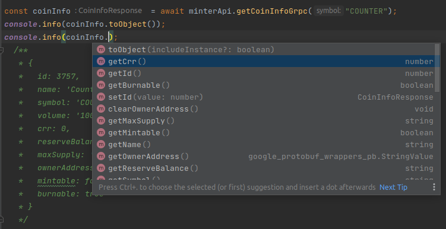

# minter-typescript-sdk

The SDK is written in TypeScript with native gRPC transport support (excluding the browser). Suitable for creating WEB 3.0 applications, console and desktop applications.

## Install

```shell
yarn add minter-typescript-sdk@github:counters/minter-typescript-sdk
# or
npm install counters/minter-typescript-sdk
```

## Init

### Http/Https transport

```ts
import MinterApi, {HttpOptions} from "minter-typescript-sdk";

const httpOptions: HttpOptions = { raw: 'http://minter-api:8843/v2/', timeout: null, headers: null };
const minterApi = new MinterApi(null, httpOptions);
```

### gRPC transport

```ts
import MinterApi, {GrpcOptions} from "minter-typescript-sdk";

const grpcOptions: GrpcOptions = { hostname: 'minter-api', port: 8842, deadline: 2500, useTransportSecurity: false };
const minterApi = new MinterApi(grpcOptions);
```


## Methods

### getCoinInfo

```ts
const coinInfo = await minterApi.getCoinInfoGrpc("COUNTER");
console.info(coinInfo.toObject());
```



